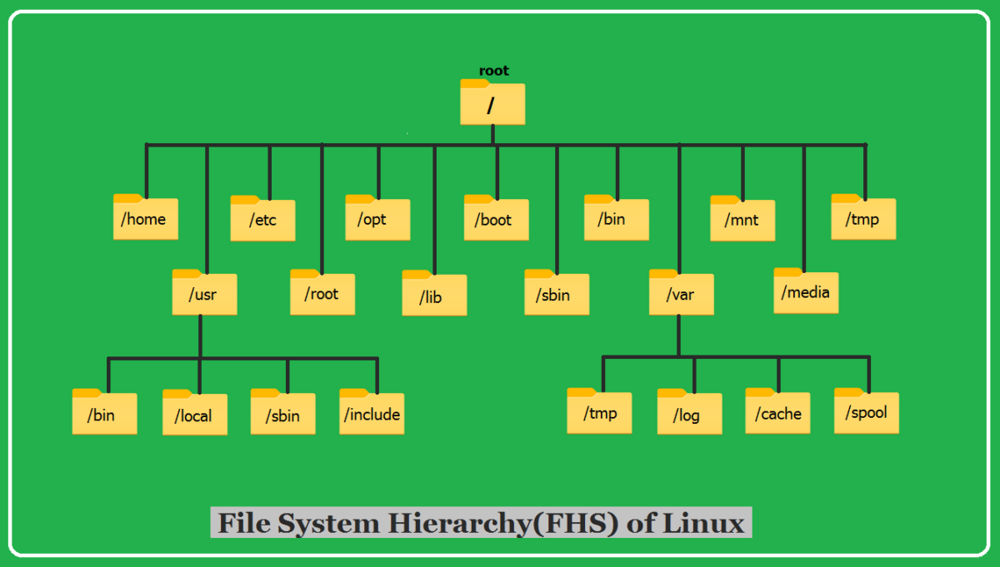

# Class 1: Introduction to GNU/Linux

Reference for Bash https://www.gnu.org/software/bash/manual/bash.html

## What is GNU/Linux?

GNU/Linux is a free and open-source operating system (OS) that consists of the **Linux kernel** and the **GNU** (GNU's Not Unix) software ecosystem. It is a powerful alternative to proprietary operating systems like **Windows** and **macOS**.  

The Linux kernel, originally created by **Linus Torvalds** in 1991, works as the **core** of the OS, managing hardware and system operations. The GNU tools and utilities, developed by the **Free Software Foundation (FSF)**, provide the necessary software components to create a fully functional operating system.  

---

## A Brief History of GNU/Linux

1. **1983** - Richard Stallman launches the **GNU Project** to develop a free Unix-like OS.
2. **1991** - Linus Torvalds creates the **Linux kernel**, initially as a personal project.
3. **1992** - The Linux kernel is combined with GNU tools, forming the first GNU/Linux system.
4. **2000s - Present** - GNU/Linux becomes widely used in **servers, desktops, mobile devices (Android), and embedded systems**.

Today, GNU/Linux powers a significant portion of the internet, cloud computing, and enterprise infrastructure.

---

## Why Use GNU/Linux Instead of Other OSs?

### **1. Open Source & Free**
Unlike Windows or macOS, GNU/Linux is **open-source**, meaning anyone can **view, modify, and distribute** the source code. This encourages transparency and security.

### **2. Stability & Performance**
Linux is known for its **robust performance**, especially in server environments. It rarely crashes and can run for **years without requiring a reboot**.

### **3. Security**
Linux has a **strong security model**, with:
- **User permissions** to prevent unauthorized access.
- **Frequent security updates**.
- A **strong community** actively fixing vulnerabilities.

### **4. Customization & Flexibility**
You can customize almost every aspect of GNU/Linux, from the desktop environment to the command-line interface. There are also multiple **distributions (distros)** to suit different needs, such as:
- **Ubuntu/Debian** (Beginner-friendly)
- **Arch Linux** (Highly customizable)
- **Fedora** (Cutting-edge software)
- **Kali Linux** (Penetration testing and security)

### **5. Package Management & Software Installation**
GNU/Linux uses **package managers** to install and update software efficiently. Examples include:
- `apt` (Debian/Ubuntu)
- `dnf` (Fedora)
- `pacman` (Arch Linux)

---

## Getting Started with GNU/Linux: Basic Commands

### **1. Checking System Information**
To check your Linux distribution and kernel version, use:

```bash
lsb_release -a  # Shows Linux distribution details
uname -r        # Shows the kernel version
```

## 2. Updating the System
Before installing any software, update your package list:
```bash
sudo apt update && sudo apt upgrade -y  # For Debian/Ubuntu
```

```bash
sudo dnf update -y                      # For Fedora
```

```bash
sudo pacman -Syu                         # For Arch Linux
```


## 3. Installing Essential Packages
To install commonly used packages like `build-essential`, `gcc` (C compiler), and `make`:

```bash
sudo apt install build-essential gcc make -y  # Debian/Ubuntu
```

```bash
sudo dnf install @development-tools -y        # Fedora
```

```bash
sudo pacman -S base-devel                      # Arch Linux
```

## 4. Navigating the File System
Basic file system commands:
```bash
pwd   # Shows the current directory
ls    # Lists files and directories
cd    # Change directory
mkdir <myfolder>  # Create a new folder
rm -r <myfolder>  # Remove a folder and its contents
```

## 5. Managing Users & Permissions
To add a new user:
```bash
sudo adduser username
```

To switch to another user:
```bash
su - username
```

## To modify file permissions:
```bash
chmod 755 filename
chown user:user filename
```

## Examples of permissions in Linux


## How to Install and Remove Software
Installing a Package
To install software, use the package manager for your distribution:

```bash
sudo apt install package_name  # Debian/Ubuntu
sudo dnf install package_name  # Fedora
sudo pacman -S package_name    # Arch Linux
```

## Removing a Package
To uninstall software:

```bash
sudo apt remove package_name  # Debian/Ubuntu
sudo dnf remove package_name  # Fedora
sudo pacman -R package_name   # Arch Linux
```

## Understanding the Linux Filesystem

Unlike Windows, where files are stored under drive letters (e.g., `C:\`), Linux organizes everything into a **single hierarchical directory structure**.

At the top level of the **Linux filesystem**, you will find the **root directory (`/`)**, which contains all other directories. Below is a table summarizing the most important directories:

| Directory | Description |
|-----------|------------|
| `/`       | The root directory, the top-level of the filesystem. |
| `/bin`    | Essential command binaries (e.g., `ls`, `cp`, `mv`). |
| `/boot`   | Contains bootloader files and the Linux kernel. |
| `/dev`    | Device files (e.g., hard drives, USBs, and other peripherals). |
| `/etc`    | Configuration files for the system and applications. |
| `/home`   | Personal directories for users (e.g., `/home/username`). |
| `/lib`    | Essential libraries required by the system. |
| `/mnt`    | Mount point for temporary filesystems or external drives. |
| `/opt`    | Optional software installed manually by users. |
| `/proc`   | Virtual filesystem providing information about system processes. |
| `/root`   | The home directory of the root (admin) user. |
| `/sbin`   | System binaries used for administrative tasks. |
| `/tmp`    | Temporary files (cleared on reboot). |
| `/usr`    | User applications, binaries, and documentation. |
| `/var`    | Log files, databases, and other variable data. |

---




## Basic Commands to Explore the Filesystem

Here are some useful commands to explore and interact with the Linux filesystem:

```bash
ls /       # List all top-level directories in the root filesystem
cd /etc    # Navigate to the /etc directory
pwd        # Show the current directory
du -sh /var/log  # Check the size of the /var/log directory
df -h      # Show available disk space
mount      # List mounted filesystems
```

# GNU/Linux Course - File System Paths

## 1. Absolute vs Relative Paths

### Comparison Table
| Feature               | Absolute Path                     | Relative Path                  |
|-----------------------|-----------------------------------|--------------------------------|
| Starting point        | Root directory (`/`)             | Current working directory      |
| Identification        | Begins with `/`                   | Never begins with `/`          |
| Reliability           | Always points to same location   | Depends on current location    |
| Use case              | Scripts, fixed locations         | Quick navigation, same context |
| Example               | `/var/log/apache2/error.log`      | `Documents/report.txt`         |

## 2. Special Directory Symbols

### Reference Table
| Symbol | Name              | Description                          |
|--------|-------------------|--------------------------------------|
| `.`    | Current directory | Refers to the present working dir    |
| `..`   | Parent directory  | One level up in hierarchy           |
| `~`    | Home directory    | Current user's home (`/home/user/`)  |
| `-`    | Previous dir      | Last visited directory (with `cd -`) |

## 3. Path Components Explained

```bash
/home/alice/Documents/report.txt
├── /     - Root directory
├── home  - Subdirectory of root
├── alice - User home directory
├── Documents - Subdirectory
└── report.txt - Target file
```

# Show current directory
```bash
pwd
```

# Change to absolute path
```bash
cd /usr/share/fonts
```

# Return to home directory
```bash
cd ~  # or just cd
```

# Go back to previous directory
```bash
cd -
```

# Current location: /home/user
```bash
cd Projects                # Enters /home/user/Projects
cd ../Downloads            # Moves to /home/user/Downloads
cd ../../var/log           # Error! Relative path exceeds root
cd ./Documents/../Videos   # Ends up in /home/user/Videos
```

```bash
mkdir -p ~/practice/dir1/dir2  # Create nested directories
touch ~/practice/file{a..d}.txt
```

## Excercise

# Start at home
```bash
cd ~
```

# 1. Navigate using relative paths
```bash
cd practice/dir1
pwd  # Shows /home/user/practice/dir1
```

# 2. Move up two levels
```bash
cd ../..
pwd  # Now at /home/user
```

# 3. Access deep directory using combination
```bash
cd ./practice/../practice/dir1/dir2
pwd  # Now at /home/user/practice/dir1/dir2
```

# 4. Return to parent's parent using ..
```bash
cd ../..
pwd  # Back to /home/user/practice
```

# 5. Absolute path jump
```bash
cd /etc
pwd  # Now at /etc
```

# 6. Return home using tilde
```bash
cd ~
pwd  # Back to /home/user
```

## 6. Path Resolution Techniques
# From any location:
```bash
cd /var/log/../lib/./  # Resolves to /var/lib
cd /home/../etc/       # Resolves to /etc
```

## 7. Common Mistakes & Solutions

| Error                      | Reason                     | Fix                                      |
|----------------------------|----------------------------|------------------------------------------|
| `cd: no such directory`    | Typo or missing directory  | Check path with `ls parent`              |
| `Permission denied`        | Lacking execute permission | Use `ls -l` to verify permissions        |
| `Not a directory`          | Path component is a file   | Check path components                    |
| `Too many levels of symlinks` | Circular symbolic links  | Use `ls -l` to inspect links             |


## 8. Advanced Navigation Tips
# Use tab completion
```bash
cd /e<tab>/sys<tab>  # Expands to /etc/systemd/
```

# Push/pop directories
```bash
pushd /var/log        # Save current location and move
popd                   # Return to saved location
```

# Combine with wildcards
```bash
cd /usr/share/*fonts  # Enters first matching dir
```

## 9. Path-related Utilities
# Get absolute path of file
```bash
readlink -f relative/path.txt
```

# Find actual path of command
```bash
which ls              # Shows /bin/ls
```

# Resolve symbolic links
```bash
realpath ~/.bashrc    # Shows full physical path
```

## 10. Visual Path Cheat Sheet
```
/
├── home/
│   └── user/
│       ├── Documents  ← ~/Documents
│       └── practice/  ← Current dir (.)
│           ├── dir1/
│           │   └── dir2/  ← Child dir
│           └── filea.txt
└── var/
    └── log/  ← Absolute path example
```