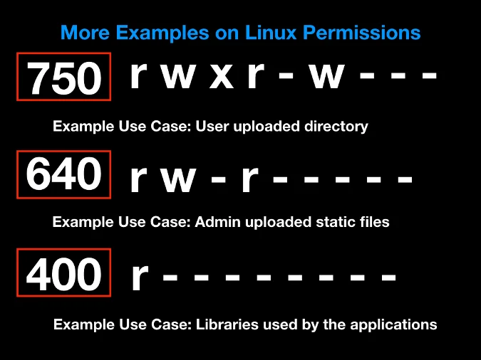
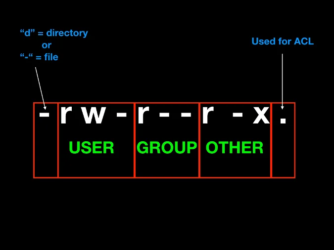

# Introduction to GNU/Linux

## What is GNU/Linux?

GNU/Linux is a free and open-source operating system (OS) that consists of the **Linux kernel** and the **GNU** (GNU's Not Unix) software ecosystem. It is a powerful alternative to proprietary operating systems like **Windows** and **macOS**.  

The Linux kernel, originally created by **Linus Torvalds** in 1991, works as the **core** of the OS, managing hardware and system operations. The GNU tools and utilities, developed by the **Free Software Foundation (FSF)**, provide the necessary software components to create a fully functional operating system.  

---

## A Brief History of GNU/Linux

1. **1983** - Richard Stallman launches the **GNU Project** to develop a free Unix-like OS.
2. **1991** - Linus Torvalds creates the **Linux kernel**, initially as a personal project.
3. **1992** - The Linux kernel is combined with GNU tools, forming the first GNU/Linux system.
4. **2000s - Present** - GNU/Linux becomes widely used in **servers, desktops, mobile devices (Android), and embedded systems**.

Today, GNU/Linux powers a significant portion of the internet, cloud computing, and enterprise infrastructure.

---

## Why Use GNU/Linux Instead of Other OSs?

### **1. Open Source & Free**
Unlike Windows or macOS, GNU/Linux is **open-source**, meaning anyone can **view, modify, and distribute** the source code. This encourages transparency and security.

### **2. Stability & Performance**
Linux is known for its **robust performance**, especially in server environments. It rarely crashes and can run for **years without requiring a reboot**.

### **3. Security**
Linux has a **strong security model**, with:
- **User permissions** to prevent unauthorized access.
- **Frequent security updates**.
- A **strong community** actively fixing vulnerabilities.

### **4. Customization & Flexibility**
You can customize almost every aspect of GNU/Linux, from the desktop environment to the command-line interface. There are also multiple **distributions (distros)** to suit different needs, such as:
- **Ubuntu/Debian** (Beginner-friendly)
- **Arch Linux** (Highly customizable)
- **Fedora** (Cutting-edge software)
- **Kali Linux** (Penetration testing and security)

### **5. Package Management & Software Installation**
GNU/Linux uses **package managers** to install and update software efficiently. Examples include:
- `apt` (Debian/Ubuntu)
- `dnf` (Fedora)
- `pacman` (Arch Linux)

---

## Getting Started with GNU/Linux: Basic Commands

### **1. Checking System Information**
To check your Linux distribution and kernel version, use:

```bash
lsb_release -a  # Shows Linux distribution details
uname -r        # Shows the kernel version
```

## 2. Updating the System
Before installing any software, update your package list:
```bash
sudo apt update && sudo apt upgrade -y  # For Debian/Ubuntu
```

```bash
sudo dnf update -y                      # For Fedora
```

```bash
sudo pacman -Syu                         # For Arch Linux
```


## 3. Installing Essential Packages
To install commonly used packages like `build-essential`, `gcc` (C compiler), and `make`:

```bash
sudo apt install build-essential gcc make -y  # Debian/Ubuntu
```

```bash
sudo dnf install @development-tools -y        # Fedora
```

```bash
sudo pacman -S base-devel                      # Arch Linux
```

## 4. Navigating the File System
Basic file system commands:
```bash
pwd   # Shows the current directory
ls    # Lists files and directories
cd    # Change directory
mkdir <myfolder>  # Create a new folder
rm -r <myfolder>  # Remove a folder and its contents
```

## 5. Managing Users & Permissions
To add a new user:
```bash
sudo adduser username
```

To switch to another user:
```bash
su - username
```

## To modify file permissions:
```bash
chmod 755 filename
chown user:user filename
```

## Examples of permissions in Linux





## How to Install and Remove Software
Installing a Package
To install software, use the package manager for your distribution:

```bash
sudo apt install package_name  # Debian/Ubuntu
sudo dnf install package_name  # Fedora
sudo pacman -S package_name    # Arch Linux
```

## Removing a Package
To uninstall software:

```bash
sudo apt remove package_name  # Debian/Ubuntu
sudo dnf remove package_name  # Fedora
sudo pacman -R package_name   # Arch Linux
```