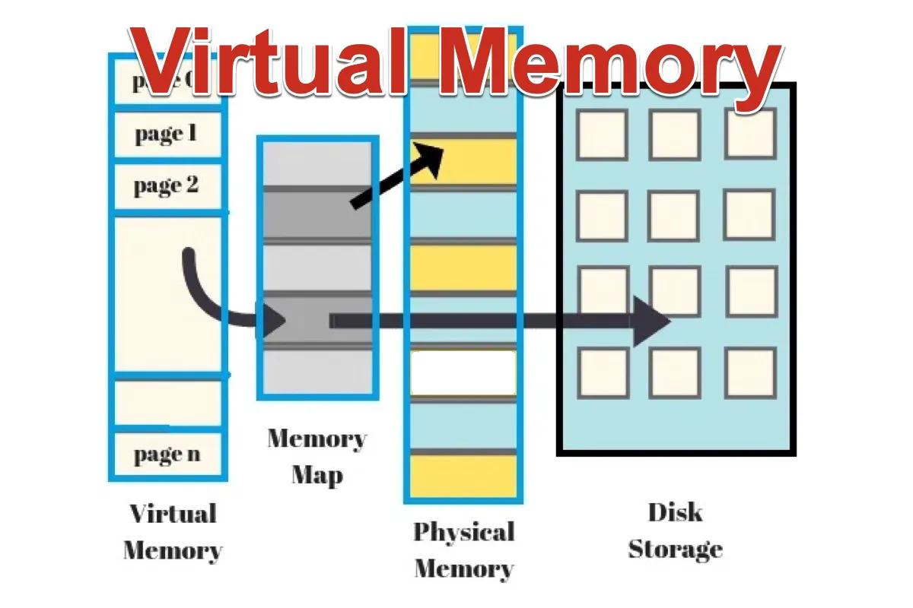
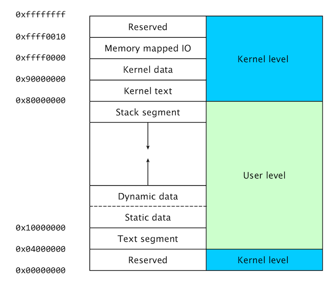
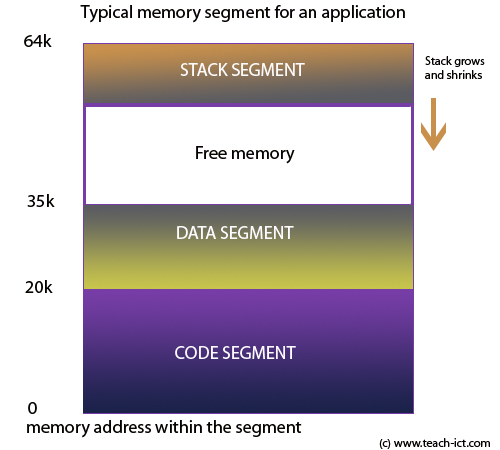

## Class 3: Process Management


## 1. What is a Process?
- A **process** is a running instance of a program (e.g., Firefox, Terminal).
- Each process has a unique **PID (Process ID)** and its own memory space.

## 2. What is a Thread?
- A **thread** is a subset of a process. Threads share the same memory and resources as their parent process.
- Lightweight and faster to create than processes.

---

## Key Differences: Process vs. Thread
| Feature          | Process                      | Thread                      |
|-------------------|------------------------------|-----------------------------|
| Isolation         | Independent                  | Shares parent process memory |
| Creation          | Slower (copying memory)      | Faster                      |
| Communication     | Complex (IPC)                | Simple (shared memory)      |
| Crash Effect      | Doesn’t affect other processes | Can crash entire process   |

---


## 3. Background vs. Foreground Processes
- **Foreground**: Runs in the terminal, blocks input until finished.
- **Background**: Runs detached from the terminal; user can continue working.

### Commands:
```bash
# Run a command in the background
sleep 60 &
```

# List background jobs
```bash
jobs
```

# Bring job 1 to foreground
```bash
fg %1
```

# Send a foreground job to background (Ctrl+Z then)
```bash
bg %1
```

## Process Control

| Command | Description | Example |
|---------|-------------|---------|
| `ps`    | Current processes | `ps aux` |
| `top`   | Live system monitor | `top` |
| `kill`  | Terminate process | `kill -9 4482` |
| `jobs`  | Background tasks | `jobs -l` |

## Priority Management
```bash
nice -n 10 long_task.sh  # Start low priority
renice 15 -p 2291        # Change priority
```

```
python script.py &  # Start in background
fg %1               # Bring job 1 to foreground
```

# 4. Memory Management Basics
The OS allocates memory to processes and ensures isolation.

Virtual Memory: Each process "thinks" it has full memory access; the OS maps virtual to physical RAM.

Threads share the parent process’s memory (faster but riskier).

## 5. Monitoring and Managing Processes (Ubuntu Commands)
Basic Process Commands:
```
# List active processes
ps aux

# List processes in real-time (exit with Ctrl+C)
top

# Interactive process viewer (install with `sudo apt install htop`)
htop

# Show threads of a process (replace PID)
ps -T -p PID

# View threads in top
top -H
```

# kill command
```
# Terminate process by PID
kill PID

# Force kill
kill -9 PID

# Kill by process name
pkill process_name
killall process_name
```

# System Memory & Stats:
```
# Show free memory (human-readable)
free -h

# Virtual memory statistics (run every 2 seconds)
vmstat 2
```

## Advanced Tools:
```
# Install stress tool
sudo apt install stress

# Create CPU load (4 workers for 60s)
stress --cpu 4 --timeout 60

# List open files by process
lsof -p PID
```

## Virtual Memory and Its Role in Memory Management



Virtual memory is a concept used by operating systems (OS) to manage memory efficiently and provide the illusion of more memory than what is physically available on a machine. It plays a critical role in modern computing, particularly when dealing with multitasking and process isolation.

1. What is Virtual Memory?
Virtual memory is a layer of abstraction between a process's memory and the physical Random-Access Memory (RAM) of a computer.

Instead of accessing physical memory directly, processes operate in a virtual address space. The OS translates this virtual memory to physical addresses behind the scenes.

Key Benefits:
Process Isolation: Each process believes it has its own dedicated memory space.

Efficient Use of RAM: Unused parts of a program are swapped out of physical memory to the disk.

Support for Large Applications: Even if an application’s memory demands exceed physical RAM, it can run using disk space.

2. How Virtual Memory Works
The mechanism involves several key steps:

* Paging:

Memory is divided into fixed-size blocks called pages.

Virtual memory is split into virtual pages, which map to physical pages in RAM or disk storage.

* Page Tables:

The OS uses a page table to maintain mappings between virtual and physical addresses.

* Swap Space:

If physical RAM runs out, inactive pages are moved to a special section of disk storage called the swap space.

When these pages are needed again, they are swapped back into RAM.

* Translation Lookaside Buffer (TLB):

A hardware cache used to speed up the translation of virtual addresses to physical addresses.

3. Processes and Memory Management
A process is an instance of a running program that requires memory to execute.

Each process operates in its own virtual address space, isolated from other processes.

## Inspect Virtual Memory of a Process:
```bash
cat /proc/<PID>/maps
```

## Check Swap Usage:
```bash
swapon --show
```


## Adjust Swappiness (swap usage preference):
```bash
sudo sysctl vm.swappiness=<value>
```


## Memory Components of a Process:





Code Segment: Contains the program's instructions.

Data Segment: Stores global and static variables.

Heap: Dynamic memory allocated during runtime.

Stack: Stores function call information (local variables, return addresses).

Exmaple:
```bash
size <my-prgram>
```

```bash
valgrind --tool=memcheck --leak-check=full ./<my-rogram>
```

## How Processes Access Memory:
When a process accesses data, the OS:

Checks if the requested page is in physical memory (RAM).

If not, a page fault occurs, and the OS retrieves the page from swap space.

4. Threads and Memory Access
Threads are smaller units of execution within a process. They share the process's memory space.

Since threads share the same virtual memory, they can:

Communicate directly without complex inter-process communication (IPC).

Risk memory corruption if not synchronized properly.


## Challenges with Virtual Memory
Page Faults:

Frequent page swapping between disk and RAM can slow down performance.

Known as thrashing when excessive swapping occurs.

Disk Performance:

Swap space is much slower than RAM, so relying heavily on virtual memory can degrade performance.


## Exerceise
```bash
sudo apt install stress -y
stress --vm 2 --vm-bytes 256M --timeout 30s
```

Analyze Process Memory:

Pick a process (e.g., a text editor) and view its memory map:
```bash
sudo apt install gedit -y
gedit &
cat /proc/$(pgrep gedit)/maps
```

## Swap usage
```bash
sudo swapoff -a
sudo swapon -a
```