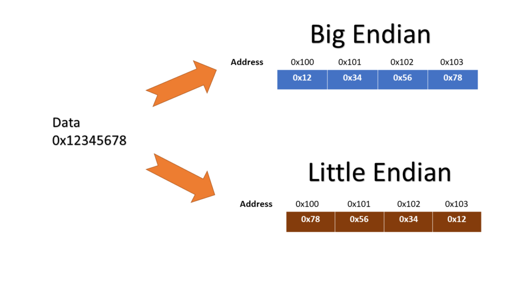
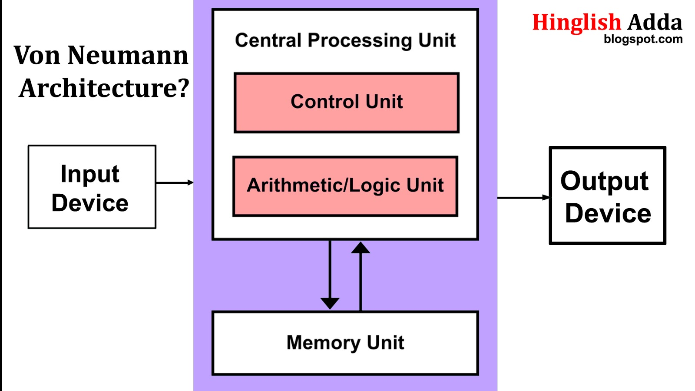

# Class5: Introduction to Computer Architecture
## Author: Daniel Ferreto


### What is Computer Architecture?
Computer architecture refers to the design of computer systems, including:
- Instruction Set Architecture (ISA)
- Microarchitecture (physical implementation)
- System design (memory, I/O, interconnects)

Key concepts:
- **ISA**: Interface between hardware and software (e.g., x86, ARM, RISC-V)
- **CISC** vs **RISC**: Complex vs Reduced Instruction Set Computing
- **Endianness**: Byte ordering in memory (Little-endian/Big-endian)

```bash
lscpu | grep "Byte Order"
```



## Common Architectures in Ubuntu
### 1. x86/x86-64
- Dominant in desktop/laptop computers
- CISC architecture (complex instructions)
- 32-bit (x86) and 64-bit (x86-64) variants

### 2. ARM
- RISC architecture
- Dominates mobile/embedded systems
- Growing presence in servers (AWS Graviton)

### 3. RISC-V
- Open-source RISC architecture
- Modular design with base ISA + extensions
- Growing adoption in academia and industry

### Key Components:
- **CPU**: Executes instructions (ALU, Control Unit, Registers)
- **Memory**: Stores data/instructions (RAM, ROM)
- **I/O Devices**: Communication interface
- **Bus System**: Data/address/control buses

### Architecture Types:
- **Von Neumann**: Single bus for data/instructions
- **Harvard**: Separate data/instruction buses

---

## Von Neumann Architecture



## Working with Architectures in Ubuntu
### Checking System Architecture
```bash
# Show CPU architecture
lscpu | grep Architecture
```

# Detailed CPU information
```bash
lscpu
```

# Kernel architecture
```bash
uname -m
```

# Multi-arch Support
Ubuntu supports multiple architectures simultaneously:
```bash
# Add RISC-V architecture support
sudo dpkg --add-architecture riscv64

# Update package lists
sudo apt update
```

## 2. Installing Software from Source (Generic Guide)
### Steps:
1. **Download Source Code**:
```bash
   wget https://example.com/software.tar.gz
   tar -xzvf software.tar.gz
   cd software/
```

```bash
./configure --prefix=/usr/local
```

## Compile
```bash
make
```

## install
```bash
sudo make install
```

## Common Issues:
Missing dependencies: Install using sudo apt install build-essential libtool autoconf

##  FPGA Fundamentals
What is an FPGA?
Field-Programmable Gate Array: Reconfigurable hardware.

## Key Components:
Configurable Logic Blocks (CLBs): Basic logic units.

Interconnects: Reconfigurable wiring.

I/O Blocks: Interface with external devices.

Memory Blocks: Store data.

Yosys Toolchain:
Yosys: Open-source framework for Verilog RTL synthesis.

##  Cross-Compilation & QEMU Emulation
What is Cross-Compilation?
Compiling code for a different architecture (e.g., ARM on x86).

Setup Cross-Compiler (ARM Example):

```bash
sudo apt upgrade -y

sudo apt install gcc-arm-linux-gnueabi qemu-user-static -y
```
```bash
sudo apt install qemu-user -y
```

# RISC-V Development in Ubuntu
Installing RISC-V Tools

```bash
sudo apt install gcc-riscv64-linux-gnu qemu-user-static -y
```

```bash
git clone --recursive https://github.com/riscv-collab/riscv-gnu-toolchain
cd riscv-gnu-toolchain
```

Simple RISC-V Program
Create `hello.c:`
```c
#include <stdio.h>

int main() {
    printf("Hello RISC-V!\n");
    return 0;
}
```

## Compile for RISC-V:
```bash
riscv64-unknown-elf-gcc -march=rv64gc -mabi=lp64d -o hello hello.c
```


# Run using QEMU:
```bash
qemu-riscv64-static hello
Hello RISC-V!
```

# Architecture Comparison Table

| **Feature**      | **x86-64**      | **ARMv8**      | **RISC-V**      |
|-------------------|-----------------|----------------|-----------------|
| **License**       | Proprietary     | Proprietary    | Open-source     |
| **Instruction Set** | CISC           | RISC           | RISC            |
| **Endianness**    | Little          | Bi-endian      | Bi-endian       |
| **Extensions**    | SSE/AVX         | NEON           | Modular         |
| **Registers**     | 16 GP           | 31 GP          | 32 GP           |

## RISC-V Architecture
Key Features
Base integer ISA (RV32I/RV64I)

Standard extensions:

* M (Integer Multiplication/Division)

* A (Atomic Operations)

* F (Single-Precision Float)

* D (Double-Precision Float)

Custom extensions possible

Privilege levels: User, Supervisor, Machine

RISC-V Assembly Example
Create `example.s:`
```asm
.section .text
.globl _start

_start:
    li a0, 42        # Load immediate value 42 into register a0
    li a7, 93        # Exit syscall number
    ecall            # Invoke syscall
```

Assemble and run:
```bash
riscv64-unknown-elf-as -o example.o example.s
riscv64-unknown-elf-ld -o example example.o
qemu-riscv64-static example
echo $?  # Should show 42
```

## Kernel and Hardware Interaction
Hardware Information

```bash
# List all hardware
sudo lshw

# Show PCI devices
lspci

# Show kernel modules
lsmod
```

## System Monitoring
```bash
# CPU usage
top

# Memory usage
free -h

# Hardware events
dmesg | less
```

# Cross-compilation
```bash
# Install cross-compiler
sudo apt install g++-riscv64-linux-gnu

# Cross-compile C++ program
riscv64-linux-gnu-g++ -o cross_app main.cpp
```

# FPGA Development
# Verilog Synthesis with Yosys

# Dependencies
```bash
sudo apt install build-essential clang bison flex \
  libreadline-dev gawk tcl-dev libffi-dev git -y
```

# install from source
```bash
git clone --recurse-submodules https://github.com/YosysHQ/yosys.git
cd yosys
git submodule init
git submodule update
make -j$(nproc)
sudo make install
```


```bash
# Update and upgrade your system
sudo apt update && sudo apt upgrade -y
# Install basic FPGA toolchain
sudo apt install yosys nextpnr-ice40 iverilog qemu-system -y
```

```bash
# Synthesize Verilog for RISC-V
yosys -p "synth_ice40 -top example -json example.json" example.v
```

```bash
nextpnr-ice40 --hx8k --package tq144 --json example.json --asc example.asc
```

```bash
sudo apt install iverilog -y
iverilog -o simulation example.v
vvp simulation
```

```bash
sudo apt install gcc-riscv64-linux-gnu -y
sudo apt install libc6-riscv64-cross -y
sudo apt install gcc-riscv64-unknown-elf -y
riscv64-linux-gnu-gcc -o main.elf main.c
qemu-riscv64 ./main.elf
```

```bash
qemu-system-riscv64 -nographic -machine virt -kernel main.elf
```

# Building Projects: Make, CMake, and Yocto


In modern embedded systems and software development, build systems play a crucial role in automating the compilation and linking process. Three of the most widely used build systems are:

1. Make – A traditional build automation tool using `Makefiles`.

2. CMake – A meta-build system that generates `Makefiles`, `Ninja` files, or project files for different platforms.

3. Yocto – A system for building complete embedded Linux distributions from source.

## Make
`make` is a tool that automates the build process using a file called a Makefile. It defines rules to compile and link source files efficiently.

* Makefile: A script defining rules to build targets from dependencies.

* Target: The file to be generated (e.g., an executable).

* Dependencies: Files required to build the target.

* Rules: Commands to generate the target from dependencies.

```make
# Define the compiler
CC = gcc

# Compiler flags
CFLAGS = -Wall -Wextra -g

# Source files
SRCS = main.c utils.c

# Object files
OBJS = main.o utils.o

# Output executable
TARGET = myprogram

# Default rule to build the target
$(TARGET): $(OBJS)
	$(CC) $(CFLAGS) -o $(TARGET) $(OBJS)

# Rule for compiling .c files into .o files
%.o: %.c
	$(CC) $(CFLAGS) -c $< -o $@

# Clean rule to remove generated files
clean:
	rm -f $(OBJS) $(TARGET)
```

* Variables (CC, CFLAGS, SRCS, etc.)

  * CC = gcc → Defines the compiler (gcc).

  * CFLAGS = -Wall -Wextra -g → Adds extra warnings and debugging symbols.

* Target ($(TARGET))
  * The rule builds myprogram from object files.
  * $(CC) $(CFLAGS) -o $(TARGET) $(OBJS) → Links all object files.

* Pattern Rule (%.o: %.c)
  * This tells make how to compile `.c` files into `.o` object files.
  * `$<` → Refers to the input file (.c file).
  * `$@` → Refers to the output file (.o file).

* Clean Rule (clean)

  * Deletes object files and the executable.

## Example of Makefile
```make
CC = gcc
CFLAGS = -Wall -g

# Build the final executable
main: main.o utils.o
	$(CC) $(CFLAGS) -o $@ $^

# Compile source files to object files
%.o: %.c
	$(CC) $(CFLAGS) -c $<

# Clean build artifacts
.PHONY: clean
clean:
	rm -f main *.o
```

Key Variables:

* $@: Target name.

* $<: First dependency.

* $^: All dependencies.

# Advanced Make Features

Automatic Dependency Generation:

```make
DEPFLAGS = -MMD -MP
CFLAGS += $(DEPFLAGS)

# Include generated dependency files
-include $(wildcard *.d)
```

Parallel Builds:

```bash
make -j$(nproc)
```

Conditional Logic:

```make
DEBUG ?= 1
ifeq ($(DEBUG), 1)
CFLAGS += -DDEBUG
endif
```

## CMake: Modern Cross-Platform Build System

* Unlike Make, which is system-dependent, CMake can generate Makefiles, Ninja build files, and Visual Studio project files.

* It provides a more flexible way to handle dependencies and configuration.

## CMake
- Cross-platform compatibility.
- Automatically handles dependencies.
- Simplifies large project builds.
- Supports a wide range of compilers and build tools.
---

Basic CMake Workflow
```cmake
cmake_minimum_required(VERSION 3.10)
project(MyProject)

# Add executable
add_executable(main main.c utils.c)

# Set compiler flags
target_compile_options(main PRIVATE -Wall -g)

# Link libraries (e.g., pthread)
target_link_libraries(main PRIVATE pthread)
```

* `cmake_minimum_required(VERSION 3.10)` → Ensures compatibility with CMake 3.10 or later.

* `project(MyProject)` → Defines the project name.

* `set(CMAKE_C_STANDARD 11)` → Specifies C11 standard.

* `add_executable(myprogram main.c utils.c)` → Defines the executable target.

* `target_compile_options(myprogram PRIVATE -Wall -Wextra -g)` → Sets compilation flags.

* `target_link_libraries(myprogram PRIVATE pthread)` → Links against `pthread`.

Definning variables
```cmake
# Define variables
set(SOURCES main.c utils.c)
set(CMAKE_C_STANDARD 11)

# Use variables
add_executable(main ${SOURCES})
```

Build
```bash
mkdir build && cd build
cmake ..  # Generate build system (e.g., Makefiles)
make      # Compile
```

## Handling External Libraries (FindPackage and FetchContent)
CMake allows integration of external libraries using find_package and FetchContent.
```cmake
find_package(OpenSSL REQUIRED)
target_link_libraries(myprogram PRIVATE OpenSSL::SSL OpenSSL::Crypto)
```

## Example: Fetching a Library with FetchContent
```cmake
include(FetchContent)
FetchContent_Declare(
    json
    GIT_REPOSITORY https://github.com/nlohmann/json.git
    GIT_TAG v3.10.5
)
FetchContent_MakeAvailable(json)
target_link_libraries(myprogram PRIVATE nlohmann_json::nlohmann_json)
```

# Yocto – The Embedded Linux Build System
Yocto is a sophisticated build system designed for creating custom Linux distributions tailored for embedded systems. Unlike general-purpose build tools like `Make` or `CMake` that focus on compiling applications, Yocto provides a comprehensive framework to build entire operating systems—including the kernel, drivers, libraries, and applications—from source.

---


## Background Theory: What is an Embedded System?
An **embedded system** is a dedicated computer system designed to perform specific tasks. Examples include:
- Smart home devices (e.g., thermostats, cameras).
- Automotive systems (e.g., infotainment, engine control).
- Industrial machines.

These systems often require:
- **Lightweight OS**: Tailored to the hardware to optimize performance.
- **Minimal Resources**: Designed for devices with limited CPU, memory, and storage.
- **Custom Software**: Supporting only the specific functions required.

Yocto allows developers to create **custom Linux distributions** optimized for these requirements.

---

## Why Use Yocto?

Yocto is widely used in embedded systems development for its flexibility and modularity. Key benefits include:
1. **Customizability**:
   - Tailor the OS to run only the components your device needs.
   - Example: A smart fridge doesn’t need desktop applications like web browsers.

2. **Reproducibility**:
   - Ensures that builds are consistent across teams and devices.
   - Developers can reproduce the same OS image, making debugging easier.

3. **Flexibility**:
   - Build from scratch, including the kernel, filesystem, and applications.
   - Support for various hardware platforms (e.g., ARM, x86).

4. **Scalability**:
   - Use Yocto to build small systems for microcontrollers or complex systems for multi-core processors.

---

## Key Components of Yocto
BitBake is the build engine of Yocto. It uses recipes to define how software components should be fetched, compiled, and installed.

### 1. **BitBake**
BitBake is Yocto’s build engine. Think of it as the “chef” that reads recipes and builds the final OS.

- **Recipes (`*.bb` files)**: Instructions to fetch, configure, compile, and package software.
- **Tasks**: Each recipe contains tasks like:
  - `do_fetch`: Download source code.
  - `do_compile`: Compile the source code.
  - `do_install`: Install the compiled files.

### 2. **Layers**
Layers are like folders that group related recipes. They provide modularity by separating:
- **BSP Layer (Board Support Package)**: Contains hardware-specific configurations (e.g., for Raspberry Pi or Intel NUC).
- **Core Layer**: Provides common utilities and libraries.
- **Custom Layer**: Contains your own recipes and configurations.

### 3. **Metadata**
Metadata describes how the build should work. It includes:
- Variables (e.g., where to find source code, how to compile it).
- Configuration files (e.g., `local.conf` for build settings).

---

## Anatomy of a Recipe (`hello.bb`)

Below is a detailed explanation of each element in a Yocto recipe:

```bitbake
SUMMARY = "A simple Hello World program"
DESCRIPTION = "This package prints Hello, World!"
LICENSE = "MIT"
SRC_URI = "file://hello.c"

S = "${WORKDIR}"  # Where files will be fetched and compiled

do_compile() {
    ${CC} hello.c -o hello
}

do_install() {
    install -D -m 0755 ${S}/hello ${D}${bindir}/hello
}
```

1. SUMMARY and DESCRIPTION: Provide metadata about the package. Useful for package managers and documentation.

2. LICENSE: Specifies the license under which the software is distributed (e.g., MIT, GPL).

3. SRC_URI: Tells Yocto where to fetch the source code or files. file:// indicates local files.

4. do_compile(): Defines the compilation process. ${CC} uses the default compiler specified by Yocto.

5. do_install(): Specifies how the compiled binary will be installed in the root filesystem.

## Example: Building an Embedded Web Server Package
Here's an example of a recipe for an embedded web server:
```bitbake
SUMMARY = "Simple Embedded Web Server"
DESCRIPTION = "A lightweight HTTP server for embedded systems."
LICENSE = "Apache-2.0"
SRC_URI = "git://example.com/lightweb.git;branch=main"

S = "${WORKDIR}"

DEPENDS = "libssl openssl"

do_compile() {
    ${CC} server.c -o lightweb -lssl -lcrypto
}

do_install() {
    install -D -m 0755 ${S}/lightweb ${D}${bindir}/lightweb
}
```

* SRC_URI: Fetches the source code from a Git repository.

* DEPENDS: Specifies dependencies (libssl and openssl) required during compilation.

* do_compile(): Links the server with SSL libraries.

* do_install(): Places the binary in the /usr/bin directory of the target filesystem.

## Layers and Configuration
To extend functionality, use layers:

1. Create a Custom Layer

Run `yocto-layer create meta-custom-layer` to generate a new layer.

Add recipes to `meta-custom-layer/recipes/`.

2. Include Layers in Build

Edit `conf/bblayers.conf` to add your custom layer path:
```shell
BBLAYERS += "/path/to/meta-custom-layer"
```

## Tools for Debugging and Testing
Yocto offers several tools to streamline development:

* Devtool: Simplifies recipe development and testing.

* BitBake Commands:

  * bitbake-layers show-layers: Lists available layers.

  * bitbake <recipe>: Builds a specific recipe.

## SUMMARY, DESCRIPTION → Metadata about the package.

* LICENSE → Defines the license.

* SRC_URI = "file://hello.c" → Fetches hello.c from local files.

* do_compile() → Compiles hello.c.

* do_install() → Installs the compiled binary into the correct location.

## Yocto on Raspberry Pi 5: A Practical Guide

### Prerequisites

#### Hardware Requirements:
- **Raspberry Pi 5** board
- **MicroSD card** (32GB or higher, formatted to FAT32)
- **Power supply and peripherals** (keyboard, mouse, monitor)

#### Software Requirements:
- **Linux-based development machine** (Ubuntu recommended)
- **Yocto Project installed** ([Yocto Quick Build Guide](https://docs.yoctoproject.org/))

---

## Step 1: Set Up the Yocto Environment

### 1. Clone the Yocto Project Repository
```bash
   sudo apt update
   sudo apt install chrpath liblz4-tool

   git clone git://git.yoctoproject.org/poky
   cd poky
   git checkout kirkstone  # Use the latest stable branch
   source oe-init-build-env # creates build folder
```

### 2. Download the Raspberry Pi BSP Layer
```bash
git clone git://git.yoctoproject.org/meta-raspberrypi
```

### 3. Add the BSP Layer to the Build Configuration
Edit `conf/bblayers.conf` and add the path to `meta-raspberrypi`:
```bash
BBLAYERS += "/absolute/path/to/meta-raspberrypi"
```

---

## Step 2: Create a Custom Layer

### 1. Generate a New Layer
```bash
bitbake-layers create-layer ~/poky/meta-custom
```

### 2. Add the Custom Layer to `bblayers.conf`
```bash
BBLAYERS += "/absolute/path/to/meta-custom"
```

---

## Step 3: Write a Recipe for "Hello, World!"

### 1. Create a Directory for Your Recipe
```bash
mkdir -p meta-custom/recipes-example/hello-world
```

### 2. Write the `hello-world.bb` Recipe
Create a file `meta-custom/recipes-example/hello-world/hello-world.bb` with the following content:
```bitbake
SUMMARY = "Hello World Application"
DESCRIPTION = "A simple Hello World program for Raspberry Pi 5"
LICENSE = "MIT"
SRC_URI = "file://hello.c"


do_compile() {
    ${CC} hello.c -o hello
}

do_install() {
    install -D -m 0755 ${S}/hello ${D}${bindir}/hello
}
```

```bash
cd ~/poky/meta-custom/recipes-example/hello-world/
mkdir -p files
```


### 3. Create the `hello.c` Source File in `files` dir:
Create `meta-custom/recipes-example/hello-world/files/hello.c`:
```c
#include <stdio.h>
int main() {
    printf("Hello, World from Raspberry Pi 5!\n");
    return 0;
}
```

---

## Step 4: Build the Image

### 1. Configure the Build for Raspberry Pi 5
Edit `conf/local.conf` and set the machine:
```bash
MACHINE = "raspberrypi5"
```

### 2. Build the Image
```bash
bitbake core-image-minimal
```

---

## Step 5: Deploy the Image

### 1. Flash the Built Image to the SD Card
Replace `/dev/sdX` with the correct device name for your SD card:
```bash
sudo dd if=tmp/deploy/images/raspberrypi5/core-image-minimal-raspberrypi5.wic of=/dev/sdX bs=4M
sync
```

## Step 6: Run the Application
Execute the program
```bash
/usr/bin/hello
```

For deeper learning, you can explore: [Yocto Project Documentation](https://docs.yoctoproject.org/)


# Further Resources

## Books:
- *"Computer Organization and Design RISC-V Edition"* by Patterson & Hennessy
- *"The RISC-V Reader"* by Waterman & Asanović

## Online Courses:
- **edX**: *"RISC-V Architecture and Programming"*
- **Coursera**: *"Computer Architecture"*

## Communities:
- **RISC-V International**: [riscv.org](https://riscv.org)
- **Ubuntu RISC-V Port**: [wiki.ubuntu.com/risc-v](https://wiki.ubuntu.com/risc-v)
