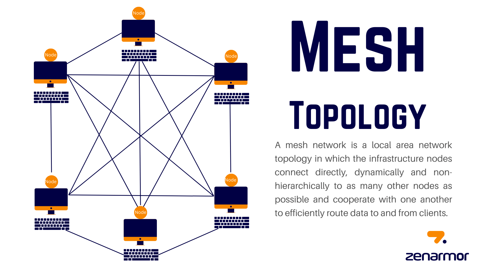

# Class 7: High-Performance Computing (HPC)
## Author: Daniel Ferreto


## Table of Contents
1. [Introduction to HPC](#introduction-to-hpc)
2. [Key Components of HPC Systems](#key-components-of-hpc-systems)
3. [HPC Terminology](#hpc-terminology)
4. [Advanced HPC Concepts](#advanced-hpc-concepts)
5. [HPC with Docker](#hpc-with-docker)
6. [HPC with Kubernetes](#hpc-with-kubernetes)
7. [Challenges in HPC](#challenges-in-hpc)

---

## Introduction to HPC

### What is HPC?
**High-Performance Computing (HPC)** refers to the use of supercomputers or clusters of computers to solve complex computational problems that require massive processing power, memory, or storage.

### Why HPC?
- **Speed**: Process large datasets faster.
- **Scalability**: Distribute workloads across thousands of nodes.
- **Precision**: Run simulations with high accuracy (e.g., climate modeling).


### Key Characteristics
- **Parallel Processing**: Split tasks across multiple processors.
- **Low Latency**: Fast communication between nodes.
- **High Throughput**: Process many tasks in a short time.

---

## Key Components of HPC Systems

### 1. Hardware
- **Compute Nodes**: Servers with CPUs/GPUs for processing.
- **Storage**: High-speed storage (e.g., NVMe, Lustre).
- **Networking**: Low-latency interconnects (e.g., InfiniBand).

### 2. Software
- **Operating System**: Linux (common in HPC).
- **Middleware**: MPI (Message Passing Interface), Slurm (job scheduler).
- **Applications**: Scientific simulations, AI/ML frameworks.


### 3. Networking
- **Topology**: Fat-tree, mesh, or hypercube.
- **Protocols**: RDMA (Remote Direct Memory Access) for fast data transfer.

---





## HPC Terminology

| Term              | Description                                                                 |
|--------------------|-----------------------------------------------------------------------------|
| **Node**           | A single computer in an HPC cluster.                                        |
| **Cluster**        | A group of nodes working together.                                          |
| **MPI**            | Library for parallel computing across nodes.                                |
| **Load Balancing** | Distributing work evenly across nodes.                                      |
| **Job Scheduler**  | Manages resource allocation (e.g., Slurm, PBS).                             |

---

## Advanced HPC Concepts

### 1. Distributed Computing
- Split tasks across geographically dispersed nodes (e.g., Hadoop/Spark).

### 2. Fault Tolerance
- Techniques like checkpointing to resume failed jobs.

### 3. Auto-Scaling
- Dynamically add/remove nodes based on workload (common in cloud HPC).

### 4. Hybrid Cloud HPC
- Combine on-premise clusters with cloud resources.


## Message Passing Interface (MPI)

### What is MPI?
**MPI** is a standardized, language-independent library for parallel computing using **message passing**. It enables communication between processes in distributed systems (clusters, supercomputers) and shared-memory systems.

### Key Characteristics
- **Distributed Memory Model**: Processes have separate memory spaces.
- **Portability**: Works across architectures (Cray, AWS, Raspberry Pi).
- **Scalability**: Supports millions of processes.

---

### MPI Architecture
1. **Communicators**: 
   - Logical groups of processes (e.g., `MPI_COMM_WORLD` for all processes).
   - Processes are identified by **rank** (unique ID within a communicator).

2. **Point-to-Point Communication**:
   - Direct communication between two processes (`MPI_Send`, `MPI_Recv`).
   - **Blocking** vs. **Non-Blocking** (e.g., `MPI_Isend`, `MPI_Irecv`).

    Blocking vs. Non-Blocking Communication
    When exchanging messages in MPI, processes can send and receive data either in a blocking or non-blocking manner.

    Blocking Communication
    * `MPI_Send` and `MPI_Recv` are blocking operations.

    * These calls do not return until the message is fully sent or received.

    * Ensures message integrity but may cause waiting delays if the sender or receiver is busy.

    ```c
    int data = 42;
    MPI_Send(&data, 1, MPI_INT, destination, tag, MPI_COMM_WORLD);
    MPI_Recv(&data, 1, MPI_INT, source, tag, MPI_COMM_WORLD, MPI_STATUS_IGNORE);
    ```
    In this example, `MPI_Send` waits until `MPI_Recv` is ready.

    Non-Blocking Communication
    * MPI_Isend and MPI_Irecv initiate the send/receive process but return immediately.

    * The operation completes in the background, allowing computation to continue.

    * Requires `MPI_Wait` or `MPI_Test` to ensure completion before using the received data.

    ```c
    int data = 42;
    MPI_Request request;
    MPI_Isend(&data, 1, MPI_INT, destination, tag, MPI_COMM_WORLD, &request);
    MPI_Wait(&request, MPI_STATUS_IGNORE); // Ensures completion before proceeding
    ```
    The non-blocking approach improves performance when overlapping computation and communication.


3. **Collective Operations**:
   - Operations involving all processes in a communicator:
     - `MPI_Bcast` (broadcast data)
     - `MPI_Scatter`/`MPI_Gather`
     - `MPI_Reduce` (sum/max/min across processes)

---

### Core MPI Functions (C/Python)
| Function            | Description                          | Example (C)                          | Python (`mpi4py`)             |
|---------------------|--------------------------------------|--------------------------------------|--------------------------------|
| **MPI_Init**        | Initialize MPI environment           | `MPI_Init(&argc, &argv);`            | Automatically initialized     |
| **MPI_Comm_size**   | Get total number of processes        | `MPI_Comm_size(MPI_COMM_WORLD, &size);` | `comm.Get_size()`             |
| **MPI_Comm_rank**   | Get current process rank             | `MPI_Comm_rank(MPI_COMM_WORLD, &rank);` | `comm.Get_rank()`             |
| **MPI_Send**        | Blocking send                        | `MPI_Send(&data, count, type, dest, tag, comm);` | `comm.send(data, dest, tag)`  |
| **MPI_Recv**        | Blocking receive                     | `MPI_Recv(&data, count, type, source, tag, comm, &status);` | `comm.recv(source, tag)`      |
| **MPI_Finalize**    | Clean up MPI resources               | `MPI_Finalize();`                    | Automatically handled         |

---

### Example: Matrix Multiplication (Python)
```python
from mpi4py import MPI
import numpy as np

comm = MPI.COMM_WORLD
rank = comm.Get_rank()
size = comm.Get_size()

if rank == 0:
    # Root process creates matrices
    A = np.random.rand(100, 100)
    B = np.random.rand(100, 100)
    chunks = np.array_split(A, size, axis=0)
else:
    chunks = None

# Scatter chunks to workers
local_A = comm.scatter(chunks, root=0)
local_B = comm.bcast(B, root=0)

# Local computation
local_C = np.dot(local_A, local_B)

# Gather results
C_chunks = comm.gather(local_C, root=0)

if rank == 0:
    # Combine results
    C = np.vstack(C_chunks)
```

1. Scattering: Root (rank 0) splits matrix A and sends chunks to workers.

2. Broadcasting: Matrix B is sent to all processes.

3. Computation: Each process multiplies its local chunk.

4. Gathering: Root collects and combines results.

---

### MPI Implementations
1. Open MPI: Popular for HPC clusters.

2. MPICH: Foundational implementation used by Intel MPI, Microsoft MPI.

3. CUDA-Aware MPI: For GPU-to-GPU communication (NVIDIA).

---


### Best Practices
1. Use non-blocking calls for overlapping computation/communication.

2. Prefer collective operations over manual point-to-point.

3. Profile with mpiP or Intel Trace Analyzer.

### Use Cases
1. Climate modeling (e.g., CESM)

2. Quantum chemistry (e.g., GAMESS)

3. CFD simulations (e.g., OpenFOAM)


## HPC with Docker

### Why Docker?
- **Isolation**: Package applications with dependencies.
- **Portability**: Run the same image on any system.

## Example: MPI Job in Docker

Create a Docker Network
```bash
docker network create mpi-network
```

#### Step 1: Create a Dockerfile
```dockerfile
FROM ubuntu:22.04
RUN apt-get update && apt-get install -y mpich python3
COPY mpi_hello.py /app/mpi_hello.py
WORKDIR /app
```

### Step 2: Build the Image
```bash
docker build -t hpc-mpi .
```

### Step 3: Run Containers with MPI
```bash
# Start a Swarm cluster (for multi-container communication)
docker swarm init

# Run 4 containers
docker run -d --name worker1 --network mpi-network hpc-mpi tail -f /dev/null
docker run -d --name worker2 --network mpi-network hpc-mpi tail -f /dev/null
docker run -d --name worker3 --network mpi-network hpc-mpi tail -f /dev/null
docker run -d --name worker4 --network mpi-network hpc-mpi tail -f /dev/null

# Execute MPI command
docker exec -it worker1 bash -c "mpiexec -np 4 -f /app/hosts.txt -launcher fork -envall python3 /app/mpi_hello.py"
```

